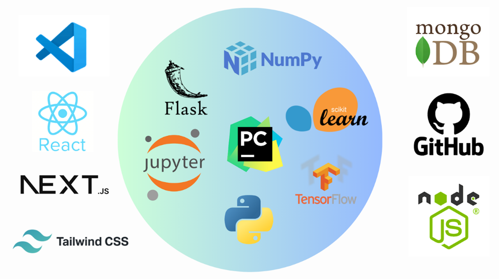

# AGRILAK: AI-Based Smart Solutions for Paddy Harvesting

## 📅 Project Timeline: Mar 2025 – Present


AGRILAK is an intelligent agricultural management system designed to revolutionize paddy harvesting using AI-driven solutions. This full-stack application leverages machine learning and deep learning algorithms, such as Random Forest Classifiers and Convolutional Neural Networks (CNNs), to provide precise and data-driven recommendations for farmers.

## 🚀 Key Features:
- **🌾 Paddy Yield Prediction** – Forecasts crop yield based on environmental and historical data.
- **🦠 Pest & Disease Detection** – Uses deep learning to identify potential threats to crops from images and data inputs.
- **🌱 Fertilizer Recommendations** – Suggests optimal fertilizer usage based on soil and weather conditions.
- **💧 Irrigation Optimization** – Provides real-time water management recommendations to enhance efficiency.

## 🏗 Technology Stack:



- **🚀 Machine Learning & Deep Learning** – Applied Random Forest for predictive analytics and CNNs for image-based classification.
- **🖥 Flask Backend** – Built a scalable API for handling predictions and data management.
- **🌐 Next.js & React Frontend** – Developed a modern and interactive user interface.
- **📊 Feature Engineering** – Processed raw agricultural datasets from APIs & Kaggle to enhance model performance.
- **📂 MongoDB Database** – Stored user inputs and AI-generated insights for real-time retrieval.
- **☁️ Cloud Deployment** – Hosted the system on a scalable cloud platform (e.g., AWS/GCP).

## 🏆 Project Outcomes:
- ✅ **End-to-End AI Solution** – Developed a full-stack application integrating AI/ML for smart paddy farming.
- ✅ **Real-Time Data Processing** – Collected and transformed agricultural data for actionable insights.
- ✅ **User-Centric Design** – Built a responsive web application with an intuitive interface for farmers.
- ✅ **Improved Precision in Agriculture** – Enabled farmers to make smarter, data-driven decisions for increased productivity and environmental sustainability.

## 🎥 Demo Video
[](https://www.youtube.com/watch?v=?)


## 🏷️ Contributors

| Name | Role |
|------|------|
| [Ranudee Fernando](https://github.com/RanudeeFernando) | Paddy Yield Prediction |
| [Dilshan Indigahawela](https://github.com/dilshanindi) | Paddy Disease Detection |
| [Dinithi Anthony](https://github.com/Dinithiii04) | Fertilizer Recommendation |
| [Binara Mendis](https://github.com/BinaraMendis7) | Irrigation Optimization |


## 📜 Getting Started

### Backend Setup
1. Create a virtual environment
   ```bash
   python -m venv venv
   ```
2. Install Python dependencies:
   ```bash
   pip install -r requirements.txt
   ```
3. Run the Flask app:
   ```bash
   python run.py
   ```

### Frontend Setup
1. Install Node.js dependencies:
   ```bash
   npm install
   ```
2. Start the Next.js server:
   ```bash
   npm run dev
   ```


## 📬 Contact
For questions or issues, reach out to the project maintainer.

---

